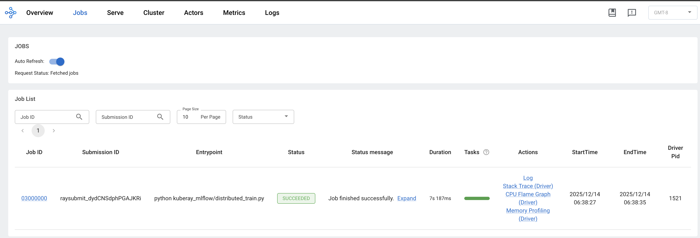
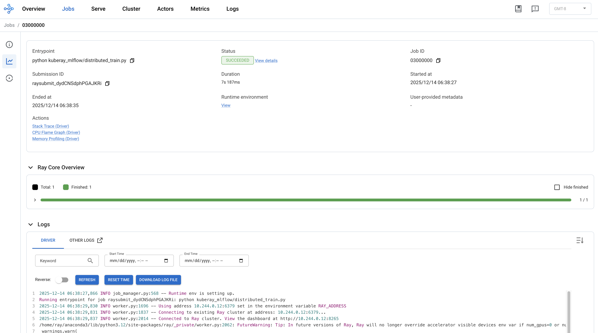
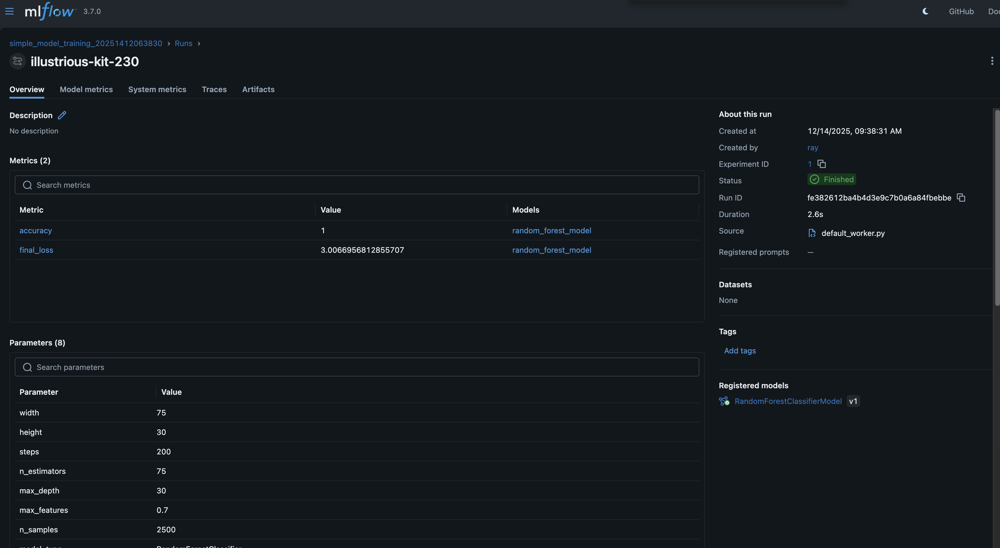
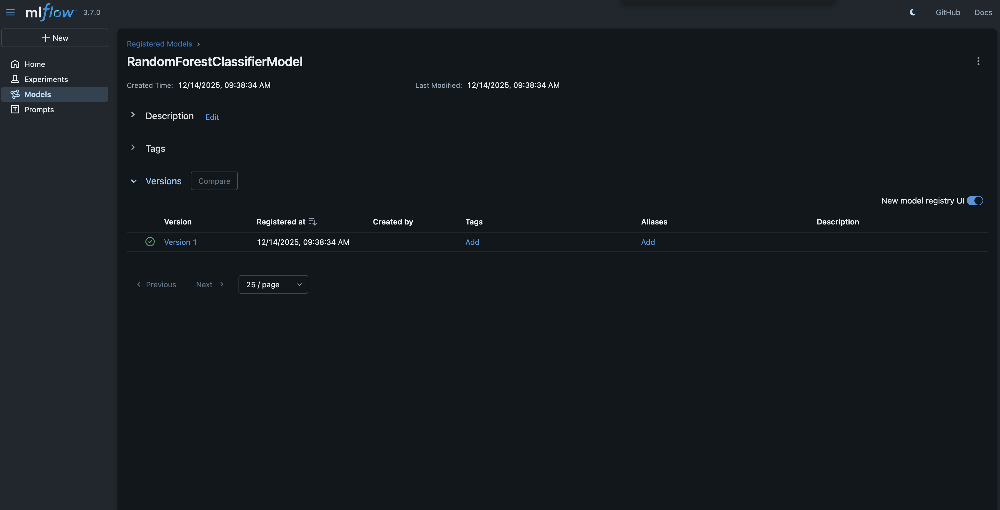
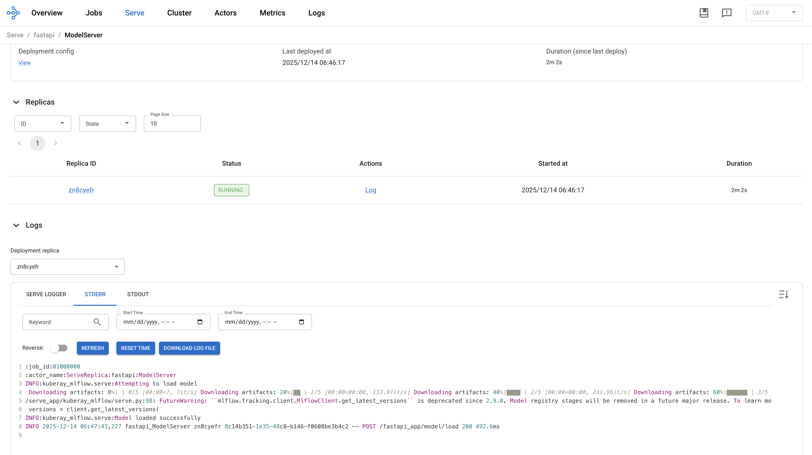

# Machine Learning Tools You Should Know About

## Developing and Service Models With KubeRay + MLFlow

Developing machine-learning models locally can be cumbersome.
A typical workflow might be:

- train a model in a notebook
- save it to disk (or deploy it to a test environment)
- manually test it with a script
- verify results or return to the top

Somewhere along the way, something changes
(dependencies upgrade or differ, the environment changes, etc.),
and the model you tested locally behaves differently once it's deployed.

There are a lot of modern tools which can help shorten this feedback loop,
but they can be complicated for people who aren't experts with them.
Using a lot of tools also means that there can be a lot of variation in how
they're deployed which adds to the complexity we mentioned earlier.

## Standardized Local Deployment

In this project, we build and run an end-to-end
machine learning workflow entirely on a local machine using some really
neat tools (some that you could use in production):

- Skaffold + Minikube to deploy everything with one command
- Ray to handle distributed training and model serving
- FastAPI + Ray Serve to expose a production-style inference API
- MLflow to track experiments, log models, and manage artifacts
- Redis as Ray’s Global Control Store (GCS) for coordination and state

Individually, none of these tools are new.
What is powerful is how they fit together.
This setup demonstrates how we can simplify our model development
and tracking process, both locally or in a hosted environment.

As mentioned above, our goal is to standardize the development process so that
your local setup looks similar to a production setup.
This is the idea behind "shift-left" methodology.
The more robustly you can run these workflows locally, the more quickly and
reliably you can ship software, models, and other pieces of tech.

### What Is Ray, and Why Use It?

At its core,
[Ray](https://www.ray.io/)
is a distributed execution engine.
Ray lets you write Python code that looks local but
can run across multiple processes, cores, or machines.
You define work using:

- Ray tasks (`@ray.remote`) for stateless distributed functions
- Ray actors for stateful, long-running workers

Behind the scenes, Ray handles everything related to distributed execution:

- Scheduling tasks across workers
- Passing data between tasks efficiently
- Tracking task execution and failures
- Monitoring, metrics, and log aggregation
- Coordinating distributed state via a control plane (GCS)

#### What Does "Distributed Training" Mean?

Distributed training doesn’t necessarily mean training a massive neural
network across hundreds of GPUs.
More generally, it is the process of running tasks on different threads,
processes, or even machines to parallelize work.
We can split up the work to train a model amongst multiple workers which means
the training can happen much faster than if everything was a single, serial batch.

In this project, Ray `remotes` are used to train a model using this distributed
pattern.
Once the model is trained, we will log
its results directly to a tool called MLflow (discussed below).

#### What Does It Mean to "Serve" a Model?

Model serving is about turning a trained model into a query-able API.
In most cases, it means running your model and exposing a `/predict` or similar
endpoint.
You can send some data to your model and it will a computation on your inputs.

With
[Ray Serve](https://docs.ray.io/en/latest/serve/index.html),
we will take our trained model and turn it into a scalable deployment.
Ray is really cool, but Serve is super cool.
I recommend taking a spin through their docs.
Serve is also framework agnostic, so we will create an
HTTP application with
[FastAPI](https://fastapi.tiangolo.com/)
and then host it with Ray, across workers, using Ray Serve.

FastAPI will give us type-safety, amazing request handling, and
custom python logic packaged into routes
while Serve optimizes and distributes across workers.

### What Is MLflow, and Why Does It Matter?

[MLflow](https://mlflow.org/)
is an experiment tracking and model management platform.
It solves a pretty hard ML problem in ML, model tracking and versioning.
For example, we will use it to:

- keep track of what we ran
- what parameters we used
- experiment results (MSE/Loss)
- version our models

MLflow provides all of the above and a lot more and makes the features
available with an intuitive UI or an SDK.
Instead of scattering models across local directories or relying on
naming conventions, MLFlow can become our system of record.

In this project, MLflow is deployed locally in Kubernetes and
integrated directly into Ray training jobs.
When a worker finishes training, it logs the model, metrics, and parameters
before uploading the trained model.

## Deploying Our Tools

We start by deploying a small but complete ML platform into a local
Kubernetes cluster.
Skaffold orchestrates the deployment order and keeps the feedback loop tight.

We will deploy:

* A namespace
* The **KubeRay operator**
* **Redis** for Ray’s control plane
* **MLflow** with persistent storage
* A **RayService** that hosts both training and serving logic

### KubeRay Operator

Ray clusters are managed in Kubernetes via custom resources.
The **KubeRay operator** watches these resources and
turns them into real Ray head and worker pods.

```yaml
# skaffold.yaml
apiVersion: skaffold/v4beta13
kind: Config
metadata:
  name: kuberay-mlflow-ray-operator
deploy:
  helm:
    releases:
      - name: kuberay-operator
        remoteChart: kuberay/kuberay-operator
        version: "1.4.2"
        namespace: kuberay-system
        createNamespace: true
        wait: true
```

This installs the official operator and enables support for
`RayCluster` and `RayService` CRDs.
From here on, Kubernetes becomes the control plane for Ray.

### Redis

Ray’s **Global Control Store (GCS)** keeps track of cluster metadata,
task ownership, and actor state.
In this setup, Redis is used as a fault-tolerant backend.

As above, we will deploy Redis with Skaffold

```yaml
# skaffold.yaml
apiVersion: skaffold/v4beta13
kind: Config
metadata:
  name: kuberay-mlflow-redis
deploy:
  kubeContext: minikube
  kubectl: {}
manifests:
  rawYaml:
    - k8s/redis/redis-deployment.yaml
```

The `redis-deployment.yaml` is pretty large, so we will omit it.
However, it will deploy Redis `Deployment` and `Service` resources.
It will also deploy a `PersistentVolumeClaim` for AOF persistence.
The `Service` will expose Redis is internally at `redis:6379` will Ray
will use in a coming section.

### MLflow

MLflow handles experiment tracking, artifact storage, and model registration.
To ensure data survives pod restarts, we back it with persistent storage:

```yaml
# k8s/mlflow/mlflow-pvc.yaml
apiVersion: v1
kind: PersistentVolumeClaim
metadata:
  name: mlflow-pvc
  namespace: kuberay-mlflow
spec:
  accessModes:
    - ReadWriteOnce
  resources:
    requests:
      storage: 10Gi
  storageClassName: standard
```

And configure MLFlow to use that new volume

```yaml
# mlflow-values.yaml
---
extraEnvVars:
  MLFLOW_SERVER_ALLOWED_HOSTS: "*"

strategy:
  type: Recreate

extraVolumes:
  - name: mlflow-volume
    persistentVolumeClaim:
      claimName: mlflow-pvc

extraVolumeMounts:
  - name: mlflow-volume
    mountPath: /mlflow/data

backendStore:
  defaultSqlitePath: "/mlflow/data/mlflow.db"

artifactRoot:
  proxiedArtifactStorage: true
  defaultArtifactsDestination: "/mlflow/data/mlartifacts"
```

Before deploying both of these with skaffold:

```yaml
# skaffold.yaml
apiVersion: skaffold/v4beta13
kind: Config
metadata:
  name: kuberay-mlflow-mlfow-storage
deploy:
  kubeContext: minikube
  kubectl: {}
manifests:
  rawYaml:
    - k8s/mlflow/mlflow-pvc.yaml
---
apiVersion: skaffold/v4beta13
kind: Config
metadata:
  name: kuberay-mlflow-mlfow
deploy:
  kubeContext: minikube
  helm:
    releases:
      - name: mlflow
        remoteChart: community-charts/mlflow
        version: "1.8.1"
        namespace: kuberay-mlflow
        wait: true
        valuesFiles:
          - k8s/mlflow/mlflow-values.yaml
portForward:
  # Port-forward the dashboard
  - resourceType: service
    resourceName: mlflow
    namespace: kuberay-mlflow
    port: 80
    localPort: 8989
requires:
  - configs:
      - kuberay-mlflow-mlfow-storage
```

This gives us a fully local, durable experiment tracking system with
SQLite storage.
As mentioned above, MLFlow has a UI.
Skaffold will port-forward our `localhost:8989` to the kubernetes
`Service`'s port 80.
When this is deployed, we can see the MLFlow UI on `localhost:8989`.

### Our Application (RayService)

The heart of this project is a **RayService**, which bundles:

* A Ray head node and workers
* A Ray Serve deployment
* A FastAPI application

```yaml
apiVersion: ray.io/v1
kind: RayService
spec:
  serveConfigV2: |
    applications:
      - name: fastapi
        import_path: kuberay_mlflow.serve.deployment
        route_prefix: /fastapi_app
```

Ray Serve automatically deploys the FastAPI app (discussed below)
and exposes it over HTTP.
The Ray cluster itself is configured to use Redis for fault tolerance:

```yaml
  rayClusterConfig:
    rayVersion: '2.52.1'
    gcsFaultToleranceOptions:
        redisAddress: "redis:6379"  # Use the redis we deployed earlier
```

At this point, we have a fully functional ML platform running locally inside Kubernetes.

### Deploying

You can now start all of the pieces of this stack with:

```bash
minikube start --cpus=8 --memory=12288 --disk-size=40g
skaffold dev
```

This might take a while.
Skaffold has to build our Ray images, which are quite large.
Once this process finishes, you can visit the MLFlow UI at
http://localhost:8989 and the Ray UI at http://localhost:8265.

## Training Our Model

With infrastructure in place, we can train a model using **Ray Jobs**.
This lets us submit training code to the running cluster without
rebuilding images or redeploying services.

### Running a Training Script

Training is triggered via the Ray Jobs API:

```bash
RAY_API_SERVER_ADDRESS=http://localhost:8265 \
    poetry run ray job submit -- python kuberay_mlflow/distributed_train.py
```

This executes the training script inside the Ray cluster.
The core training function is defined as a Ray remote:

```python
@ray.remote
def train_and_upload_model(
    mlflow_tracking_uri,
    width: int = 50,
    height: int = 25,
    steps: int = 100,
):
```

Because this function runs inside Ray, it can be parallelized, scaled,
or scheduled across workers with no code changes.

First, our script will create a new MLFlow experiment and start the run:

```python
    formatted_date = datetime.now().strftime("%Y%d%m%H%M%S")
    experiment_name = f"simple_model_training_{formatted_date}"

    mlflow.set_tracking_uri(mlflow_tracking_uri)
    mlflow.set_experiment(experiment_name)

    n_estimators = max(10, width)
    max_depth = max(2, height)
    max_features = min(1.0, 0.3 + (steps / 500))

    n_samples = min(5000, 500 + steps * 10)
    n_features = 20
    n_informative = max(2, n_features // 2)

    with mlflow.start_run() as run:
        mlflow.log_params(
            {
                "width": width,
                "height": height,
                "steps": steps,
                "n_estimators": n_estimators,
                "max_depth": max_depth,
                "max_features": max_features,
                "n_samples": n_samples,
                "model_type": "RandomForestClassifier",
            }
        )

        print(
            f"Training RandomForest("
            f"n_estimators={n_estimators}, "
            f"max_depth={max_depth}, "
            f"max_features={max_features})"
        )
```

Next, we will generate some data and train a parameterized `RandomForest` model:

```python
        X, y = make_classification(
            n_samples=n_samples,
            n_features=n_features,
            n_informative=n_informative,
            n_redundant=n_features - n_informative,
            n_classes=2,
            random_state=42,
        )

        model = RandomForestClassifier(
            n_estimators=n_estimators,
            max_depth=max_depth,
            max_features=max_features,
            n_jobs=1,
            random_state=42,
        )

        model.fit(X, y)
```

Finally, we can log all metrics to MLFlow and upload the model:

```python
        predictions = model.predict(X)
        accuracy = accuracy_score(y, predictions)

        mlflow.log_metrics(
            {
                "accuracy": accuracy,
                "final_loss": evaluation_fn(steps - 1, width, height),
            }
        )

        mlflow.sklearn.log_model(model, "random_forest_model")

        result = mlflow.register_model(
            f"runs:/{run.info.run_id}/random_forest_model",
            "RandomForestClassifierModel",
        )

        return {
            "accuracy": accuracy,
            "model_source": result.source,
            "run_id": run.info.run_id,
        }
```

Let's run this using the `ray` command line tool:

```bash
$ RAY_API_SERVER_ADDRESS=http://localhost:8265 poetry run ray job submit -- python kuberay_mlflow/distributed_train.py

Job submission server address: http://localhost:8265

-------------------------------------------------------
Job 'raysubmit_dydCNSdphPGAJKRi' submitted successfully
-------------------------------------------------------

Next steps
  Query the logs of the job:
    ray job logs raysubmit_dydCNSdphPGAJKRi
  Query the status of the job:
    ray job status raysubmit_dydCNSdphPGAJKRi
  Request the job to be stopped:
    ray job stop raysubmit_dydCNSdphPGAJKRi

Tailing logs until the job exits (disable with --no-wait):
2025-12-14 06:38:27,866 INFO job_manager.py:568 -- Runtime env is setting up.
Running entrypoint for job raysubmit_dydCNSdphPGAJKRi: python kuberay_mlflow/distributed_train.py
2025-12-14 06:38:29,830 INFO worker.py:1696 -- Using address 10.244.0.12:6379 set in the environment variable RAY_ADDRESS
2025-12-14 06:38:29,831 INFO worker.py:1837 -- Connecting to existing Ray cluster at address: 10.244.0.12:6379...
2025-12-14 06:38:29,837 INFO worker.py:2014 -- Connected to Ray cluster. View the dashboard at http://10.244.0.12:8265
/home/ray/anaconda3/lib/python3.12/site-packages/ray/_private/worker.py:2062: FutureWarning: Tip: In future versions of Ray, Ray will no longer override accelerator visible devices env var if num_gpus=0 or num_gpus=None (default). To enable this behavior and turn off this error message, set RAY_ACCEL_ENV_VAR_OVERRIDE_ON_ZERO=0
  warnings.warn(
(train_and_upload_model pid=503, ip=10.244.0.11) 2025/12/14 06:38:31 INFO mlflow.tracking.fluent: Experiment with name 'simple_model_training_20251412063830' does not exist. Creating a new experiment.
(train_and_upload_model pid=503, ip=10.244.0.11) Training RandomForest(n_estimators=75, max_depth=30, max_features=0.7)
(train_and_upload_model pid=503, ip=10.244.0.11) 2025/12/14 06:38:32 WARNING mlflow.models.model: `artifact_path` is deprecated. Please use `name` instead.
(train_and_upload_model pid=503, ip=10.244.0.11) Successfully registered model 'RandomForestClassifierModel'.
(train_and_upload_model pid=503, ip=10.244.0.11) 2025/12/14 06:38:34 WARNING mlflow.tracking._model_registry.fluent: Run with id fe382612ba4b4d3e9c7b0a6a84fbebbe has no artifacts at artifact path 'random_forest_model', registering model based on models:/m-8e7ddfc5d69349d8ba73b56b55b1987a instead
(train_and_upload_model pid=503, ip=10.244.0.11) 2025/12/14 06:38:34 INFO mlflow.store.model_registry.abstract_store: Waiting up to 300 seconds for model version to finish creation. Model name: RandomForestClassifierModel, version 1
(train_and_upload_model pid=503, ip=10.244.0.11) Created version '1' of model 'RandomForestClassifierModel'.
Training completed: {'accuracy': 1.0, 'model_source': 'models:/m-8e7ddfc5d69349d8ba73b56b55b1987a', 'run_id': 'fe382612ba4b4d3e9c7b0a6a84fbebbe'}
(train_and_upload_model pid=503, ip=10.244.0.11) 🏃 View run illustrious-kit-230 at: http://mlflow:80/#/experiments/1/runs/fe382612ba4b4d3e9c7b0a6a84fbebbe
(train_and_upload_model pid=503, ip=10.244.0.11) 🧪 View experiment at: http://mlflow:80/#/experiments/1

------------------------------------------
Job 'raysubmit_dydCNSdphPGAJKRi' succeeded
------------------------------------------
```

### Viewing Our Logs (Ray)

We can see these same logs in the Ray.
Let's navigate to http://localhost:8265/#/jobs and select our job.



Then navigate to the logs section.



### Viewing Our Model (MLFlow)

We can now view our experiment and model in MLFlow.
Let's navigate to the MLFlow UI at http://localhost:8989/#/ and
select `Experiments`.
We can see all of the parameters an metrics for the run.



Finally, we can see the model under the `Models` tab.



## Using Our Model

Once training completes, the model exists in MLflow but it isn’t yet
loaded into the serving process.

### Loading the Model

We explicitly load the latest model into Ray Serve:

```bash
$ curl -X POST http://localhost:8000/fastapi_app/model/load
{
  "model_loaded": true,
  "model_info": {
    "name": "RandomForestClassifierModel",
    "version": "1",
    "stage": "None",
    "description": "No description available",
    "creation_timestamp": 1765723114156
  },
  "mlflow_uri": "http://mlflow:80",
  "timestamp": "2025-12-14T06:47:43.226366"
}
```

This pulls the model from MLflow’s registry and makes it
available for inference without redeploying anything.
We can also view these logs in Ray.



### Running a Prediction

With the model loaded, we can send inference requests directly to the FastAPI endpoint:

```bash
$ curl -X POST http://localhost:8000/fastapi_app/predict \
  -H "Content-Type: application/json" \
  -d '{
    "features": [[1.0, 2.0, 3.0, 4.0, 5.0,
                  6.0, 7.0, 8.0, 9.0, 10.0,
                  11.0, 12.0, 13.0, 14.0, 15.0,
                  16.0, 17.0, 18.0, 19.0, 20.0]]
  }'
{
  "predictions": [
    1
  ],
  "probabilities": [
    [
      0.37333333333333335,
      0.6266666666666667
    ]
  ],
  "model_version": "1",
  "timestamp": "2025-12-14T06:48:27.027234"
}
```

Ray Serve routes the request to a model replica, executes the prediction,
and returns the result synchronously.

## Conclusion
At this point, we trained, deployed, and ran a machine learning model,
albeit a small one.
Thanks for following along! All code can be found on GitHub!
