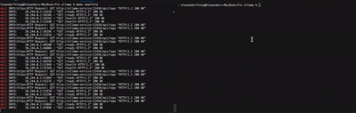

# Building Production-Ready LLM APIs: A DevOps Approach

I've spent years building infrastructure for distributed services, and
one pattern keeps proving itself: developing locally is hard!
When I recently needed to build an LLM API, I wanted to make development easy
and as painless as possible.
I also don't have a GPU on my machine, so I wanted to run things that were
CPU-capable.

The result is a development environment that runs on my laptop and does so
efficiently.
This might not be the best way to serve `ollama` or a model in prouction,
but at least it lets developers test things locally without connecting
to external services.
It also does so in a standardized way with containers and your team's
deployment artifacts.

Note to readers: I am going to be using the
[`ollama-python`](https://github.com/ollama/ollama-python)
client directly in my routes which might not be the best.
I am also not serving or streaming the responses via something like
[`langserve`](https://github.com/langchain-ai/langserve).

For all of the relevant code, please visit my
[GitHub repo](https://github.com/afoley587/coding-challenges-2025/tree/main/machine-learning/ollama)!

## Why DevOps Practices Matter for LLM (and all) Development

Most LLM tutorials skip the DevOps-related stuff and jump to the code.
I think that's super helpful for most software engineers, but I wanted to go
over what (as I view) is the missing parts.
When you're developing locally, the less friction you face the better your code
becomes.

We need to:

- Develop locally without friction (develop experience)
- Deploy updates without manual steps (develop experience)
- Monitor performance and debug issues (develop experience)
- Develop without depending on external APIs (cost and rate limit management)
- Ensure your local environment matches production as much as possible (prod parity)

These are standard DevOps problems with well-established solutions.
We can apply them just about anywhere!

This project tries to demonstrate those patterns.
Everything runs in Kubernetes using
[Minikube](https://minikube.sigs.k8s.io/docs/),
with
[Skaffold](https://skaffold.dev/)
managing the development workflow.
The FastAPI
gateway sits in front of
[Ollama (the model server)](https://ollama.com/),
collecting metrics and
handling requests.

The tooling might seem heavy for local development but I'm hoping to
prove that it's not!
Starting with the right tooling makes future feature development and debugging
so much easier.

## Project Tech Stack

Ollama handles model serving.
It's specifically optimized for running LLMs on
consumer hardware, including Apple Silicon.
Unlike alternatives like vLLM (which expects GPUs and Linux),
Ollama works great on a MacBook.
It downloads models from a registry, manages them efficiently,
and provides a simple API.

Minikube gives us a real Kubernetes cluster on localhost.
The manifests you write for Minikube work identically in GKE,
EKS, or any other Kubernetes environment.

Skaffold watches your code and automatically rebuilds and redeploys when you
make changes.
Without Skaffold, every code change can mean we need to:

1. re-build the image

1. update kubernetes manifest

1. apply to cluster

1. wait for rollout

With Skaffold, you save the file and it's live almost instantly.
It also handles other kubernetes abstractions like port forwarding,
which you'll see in this post.

FastAPI provides the API gateway.
It handles request validation, metrics collection, health checks,
and sits between clients and Ollama.
This separation lets you add authentication, rate limiting, or multi-model routing
without touching the inference engine.

## The Kubernetes Manifests

### Namespace

```yaml
apiVersion: v1
kind: Namespace
metadata:
  name: llm-serving
```

Simple isolation. Everything related to LLM serving goes in this namespace,
keeping it separate from other projects.

### Ollama StatefulSet

I chose a `StatefulSet` over a `Deployment` for Ollama because models are large
(the small Qwen 2.5 model is still 300MB) and you don't want to re-download
them every time a pod restarts.
`StatefulSets` provide stable storage that persists across restarts.

```yaml
apiVersion: apps/v1
kind: StatefulSet
metadata:
  name: ollama
  namespace: llm-serving
spec:
  serviceName: ollama-service
  replicas: 1
  selector:
    matchLabels:
      app: ollama
  template:
    spec:
      initContainers:
      - name: pull-model
        image: ollama/ollama:latest
        command:
          - /bin/sh
          - -c
          - |
            if [ -d "/root/.ollama/models" ] && [ "$(ls -A /root/.ollama/models 2>/dev/null)" ]; then
              echo "Model already downloaded, skipping pull"
              exit 0
            fi

            echo "Downloading model..."
            ollama serve &
            sleep 5
            ollama pull qwen2.5:0.5b
            pkill ollama
        volumeMounts:
        - name: ollama-data
          mountPath: /root/.ollama
```

The `initContainer` handles model downloading.
It checks if the model exists and only downloads if necessary.
This means the first startup takes a few minutes,
but subsequent restarts are fast because the model is cached in the
`PersistentVolume`.

The main container configuration is straightforward:

```yaml
      containers:
      - name: ollama
        image: ollama/ollama:latest
        ports:
        - containerPort: 11434
        env:
        - name: OLLAMA_HOST
          value: "0.0.0.0:11434"
        resources:
          requests:
            memory: "2Gi"
            cpu: "1000m"
          limits:
            memory: "6Gi"
            cpu: "4000m"
```

Resource limits are important here!
Without them, Ollama could consume all available
memory and crash the node.
The 2Gi request ensures Kubernetes schedules the
pod only on nodes with enough memory.
The 6Gi limit prevents runaway memory usage.
You might have to adjust those settings depending on the physical
resources of your machine.

Storage is handled through a `volumeClaimTemplate`:

```yaml
  volumeClaimTemplates:
  - metadata:
      name: ollama-data
    spec:
      accessModes:
        - ReadWriteOnce
      storageClassName: standard
      resources:
        requests:
          storage: 10Gi
```

Each pod in the StatefulSet gets its own `PersistentVolumeClaim`.
The model persists between restarts, and Minikube's standard storage
class uses the local filesystem.

### API Gateway Deployment

The FastAPI service runs as a standard `Deployment` with multiple replicas:

```yaml
apiVersion: apps/v1
kind: Deployment
metadata:
  name: llm-api
  namespace: llm-serving
spec:
  replicas: 2
  template:
    spec:
      containers:
      - name: api
        image: llm-api:latest
        env:
        - name: OLLAMA_HOST
          value: "http://ollama-service:11434"
        - name: MODEL_NAME
          value: "qwen2.5:0.5b"
        resources:
          requests:
            memory: "256Mi"
            cpu: "200m"
          limits:
            memory: "512Mi"
            cpu: "500m"
```

Two replicas provide high availability.
If one pod crashes, the other keeps serving traffic.
The API is lightweight compared to Ollama, so resource
requirements are minimal.

We have a few probes as well:

```yaml
        livenessProbe:
          httpGet:
            path: /health
            port: 8080
          initialDelaySeconds: 10
          periodSeconds: 15
        readinessProbe:
          httpGet:
            path: /ready
            port: 8080
          initialDelaySeconds: 5
          periodSeconds: 5
```

Liveness checks if the pod is alive.
Readiness checks if it's ready to serve traffic.
In our case, the distinction is important.
The `health` endpoint will just return a simple `pong` response
whereas the `ready` endpoint will make sure Ollama is ready to
accept traffic.

## The FastAPI Application

The application uses modern FastAPI patterns with lifecycle management and
dependency injection.
We can then add custom metrics and health endpoints on top of what FastAPI
provides.

### Lifecycle Management

FastAPI's lifespan context manager handles startup and shutdown:

```python
@asynccontextmanager
async def lifespan(app: FastAPI):
    # Startup
    logger.info("Starting up application...")

    state.config = Config()
    state.metrics = Metrics()
    state.ollama_client = ollama.Client(host=state.config.OLLAMA_HOST)

    try:
        models = state.ollama_client.list()
        logger.info(f"Connected to Ollama. Available models: {[m['name'] for m in models.get('models', [])]}")
    except Exception as e:
        logger.warning(f"Could not connect to Ollama on startup: {e}")

    yield

    # Shutdown
    logger.info("Shutting down application...")
```

This ensures everything initializes in the correct order.
Configuration loads first, then metrics, then the Ollama client.
We verify the connection at startup and log available models.
If Ollama isn't ready yet, we log a warning
but don't crash - the readiness probe will fail until Ollama is available.

### Dependency Injection

Instead of global variables, we use FastAPI's dependency injection:

```python
class AppState:
    config: Config
    metrics: Metrics
    ollama_client: ollama.Client

state = AppState()

def get_config() -> Config:
    return state.config

def get_metrics() -> Metrics:
    return state.metrics

def get_ollama_client() -> ollama.Client:
    return state.ollama_client
```

Endpoints declare their dependencies explicitly:

```python
@app.post("/v1/generate", response_model=GenerationResponse)
async def generate(
    request: GenerationRequest,
    client: ollama.Client = Depends(get_ollama_client),
    config: Config = Depends(get_config),
    metrics: Metrics = Depends(get_metrics)
):
    # client, config, and metrics are injected
```

This makes testing easier - you can override dependencies with mocks.
It also makes the code more explicit about what each endpoint needs.

### Prometheus Metrics

Metrics are centralized in a class:

```python
class Metrics:
    def __init__(self):
        self.registry = CollectorRegistry()

        gc_collector.GCCollector(registry=self.registry)
        platform_collector.PlatformCollector(registry=self.registry)
        process_collector.ProcessCollector(registry=self.registry)

        self.request_count = Counter(
            "afoley_vllm_requests_total",
            "Total LLM requests",
            ["status"],
            registry=self.registry,
        )

        self.request_duration = Histogram(
            "afoley_vllm_request_duration_seconds",
            "Request duration in seconds",
            registry=self.registry,
        )

        self.tokens_generated = Counter(
            "afoley_vllm_tokens_generated_total",
            "Total tokens generated",
            registry=self.registry,
        )
```

We create a custom registry to avoid collision issues if the application
reloads.
The default collectors (GC, platform, process) provide useful system
metrics.
Custom metrics track what matters for LLM serving
(request counts, latency, and token throughput).

Using the metrics is straightforward:

```python
start_time = time.time()

try:
    response = client.generate(model=config.MODEL_NAME, prompt=request.prompt, ...)

    metrics.request_count.labels(status="success").inc()
    metrics.request_duration.observe(time.time() - start_time)
    metrics.tokens_generated.inc(tokens_generated_count)

except ResponseError as e:
    metrics.request_count.labels(status="error").inc()
    raise
```

The metrics endpoint exposes everything to Prometheus:

```python
@app.get("/metrics")
async def get_metrics_endpoint(metrics: Metrics = Depends(get_metrics)):
    return Response(
        content=generate_latest(metrics.registry),
        media_type=CONTENT_TYPE_LATEST
    )
```

In production, you'd configure Prometheus to scrape this endpoint.
For local development, you can `curl` it to see what's happening.

### Interacting with Ollama

The
[ollama-python](https://github.com/ollama/ollama-python)
SDK makes this clean:

```python
response = client.generate(
    model=config.MODEL_NAME,
    prompt=request.prompt,
    options={
        "num_predict": request.max_tokens,
        "temperature": request.temperature,
        "top_p": request.top_p,
    }
)

generated_text = response.get('response', '')
tokens_generated_count = response.get('eval_count', 0)
finish_reason = "stop" if response.get('done', False) else "length"
```

We don't need to use `requests` / `httpx` / `aiohttp` / etc. to make any
requests. Error handling is also simpler:

```python
except ResponseError as e:
    metrics.request_count.labels(status="error").inc()
    logger.error(f"Ollama error: {e}")

    status_code = getattr(e, 'status_code', 500)
    raise HTTPException(status_code=status_code, detail=f"Ollama error: {str(e)}")
```

ResponseError gives you the status code and error message from Ollama.
You can pass these directly to your API clients.
The downside of using the `ollama-python` library here directly is, of course,
dependency inversion which is out of scope for this blog.

### Health and Readiness Probes

The health check is simple:

```python
@app.get("/health", response_model=HealthResponse)
async def health():
    """
    Liveness probe - checks if the service is alive

    This endpoint just performs a basic `ping` check
    """
    return HealthResponse(status="healthy")
```

Readiness is more thorough:

```python
@app.get("/ready", response_model=ReadinessResponse)
async def readiness(
    client: ollama.Client = Depends(get_ollama_client),
    config: Config = Depends(get_config)
):
    models = client.list()
    model_names = [model['name'] for model in models.get('models', [])]
    model_loaded = config.MODEL_NAME in model_names

    if not model_loaded:
        raise HTTPException(
            status_code=503,
            detail=f"Model {config.MODEL_NAME} not loaded"
        )

    return ReadinessResponse(
        status="ready",
        ollama="connected",
        model_loaded=True,
        model_name=config.MODEL_NAME
    )
```

We verify that we can connect to Ollama an that
the specific model we need is actually loaded.
If Ollama is up but the model isn't ready,
the readiness probe fails and Kubernetes won't route traffic to this pod yet.

## The Development Workflow with Skaffold

Skaffold configuration is pretty straightforward.

First, we deploy the kubernetes namespace:

```
---
apiVersion: skaffold/v4beta13
kind: Config
metadata:
  name: ollama-fastapi-namespace

manifests:
  rawYaml:
    - k8s/namespace.yaml

deploy:
  kubeContext: minikube
  kubectl: {}
```

Then, we deploy Ollama and our API:

```yaml
apiVersion: skaffold/v4beta11
kind: Config
metadata:
  name: ollama-fastapi-deployments

build:
  artifacts:
    - image: afoley587/coding-challenges/ollama-fastapi
      context: python/
      docker:
        dockerfile: Dockerfile

deploy:
  kubeContext: minikube
  kubectl: {}

manifests:
  rawYaml:
    - k8s/ollama-statefulset.yaml
    - k8s/api-deployment.yaml

# Automatically forward the service to localhost
portForward:
  - resourceType: service
    resourceName: llm-api-service
    namespace: llm-serving
    port: 8080
    localPort: 8080

requires:
  - configs:
      - ollama-fastapi-namespace
```

We can see that `skaffold` will:

1. Build our artifacts, `afoley587/coding-challenges/ollama-fastapi`

1. Deploy the API `Deployment` and Ollama `StatefulSet` to Minikube

1. Port forward our `localhost:8080` to the API `Service` port 8080

Running it is simple:

```bash
make skaffold

# Or manually via
skaffold dev
```

Skaffold builds your image, deploys all manifests, starts streaming logs, and
watches for changes.
When you edit `app.py`, you see the change reflected immediately.

## Testing the Service

We can run through some functional tests with `curl` to trigger queries,
check statuses, and see the metrics.

### Check health

First, let's just make sure that our application is healthy and that
port-forwarding is working as expected:

```bash
$ curl --silent http://localhost:8080/health
{"status":"healthy"}
```

Next, let's use an LLM to generate some text:

```bash
$ curl -X POST --silent http://localhost:8080/v1/generate \
  -H "Content-Type: application/json" \
  -d '{
    "prompt": "Explain Kubernetes in simple terms:",
    "max_tokens": 150,
    "temperature": 0.7
  }' | jq
{
  "generated_text": "Kubernetes (K8s) is an open-source container orchestration platform that allows users to manage and deploy applications across multiple nodes or servers through a single interface. It is based on the principles of the cloud-native computing model, which aims to make it easy for developers to build, run, and scale applications in a distributed environment.\nThe key features of Kubernetes include:\n\n  * Containerization: Containers are lightweight units of software that can be developed, built, and deployed independently of an operating system. They allow users to create applications with minimal dependencies on the operating system.\n  * Replication: Kubernetes automatically replicates replicas of the application across multiple nodes or servers. This ensures that if one server fails, it will not affect the availability of the entire",
  "prompt": "Explain Kubernetes in simple terms:",
  "tokens_generated": 150,
  "finish_reason": "stop",
  "model": "qwen2.5:0.5b"
}
```

Finally, let's check our metrics to make sure things like token
counts are properly tracked:
```bash
$ curl --silent http://localhost:8080/metrics | grep afoley_vllm_tokens_generated_total
# HELP afoley_vllm_tokens_generated_total Total tokens generated
# TYPE afoley_vllm_tokens_generated_total counter
afoley_vllm_tokens_generated_total 150.0
```

We've only made one request to the API for 150 tokens.
The `afoley_vllm_tokens_generated_total` matches what we expected!

Here's the demo:



## What I Learned

Running models locally is more practical than I expected.
The Qwen 2.5 model (0.5B parameters) generates text at acceptable speeds
on a laptop CPU. For development, that's seems like plenty to me.
You can save API costs, work offline, and iterate faster.

Ollama really impressed me!
It handles model downloads, manages versions, and provides a clean API.
The fact that it works well on Apple Silicon really matters to me!
Most ML tools assume Linux and NVIDIA GPUs which wasn't viable for me.

Skaffold also really changed how I develop code.
The intelligent file-watching, declarative port forwarding, and
centralization oh build/deployment options has made my life a lot easier.
It also applies to so many different deployment systems and toolchains.

## Production Considerations

To move this to production, you'd need a lot of things and a production-ready
stack wasn't the point of this post.
You might want to add:

1. Authentication: Add JWT validation or API keys to the FastAPI gateway.

1. Rate limiting: Implement per-user rate limits to prevent abuse.

1. Streaming: Stream responses to the user with something like `langserve`.

1. Dependency Inversion: Use a more generic SDK so that model-swapping
   is easier.

1. Monitoring: Deploy Prometheus and Grafana. Set up alerts for high latency or
   error rates.

1. Larger models: Swap Qwen 2.5 for Llama 3.1 or similar. Adjust resource limits
   accordingly.

1. GPU support: Add GPU nodes to your cluster. Update Ollama's resource requests
   to include GPUs.

1. Horizontal scaling: Add HorizontalPodAutoscaler for the API gateway based on
   CPU or custom metrics.

1. Ingress: Configure an ingress controller for proper routing and SSL
   termination.

But the architecture stays (mostly) the same.

## Wrapping Up

This project demonstrates how DevOps best practices
can apply to LLM development.
The infrastructure patterns such as containerization,
orchestration, observability,
reproducible workflows aren't ML-specific.
They can be use when working with any production application.

Starting with these patterns can help trim technical debt and speed
up your development lifecycle.
Your deployment process can also become automated and you begin to adopt
a "shift-left" thinking.

For all of the relevant code, please visit my
[GitHub repo](https://github.com/afoley587/coding-challenges-2025/tree/main/machine-learning/ollama)!
